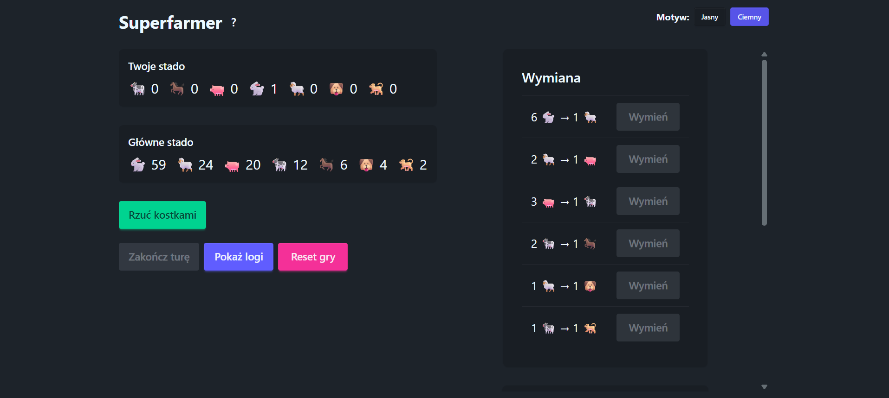
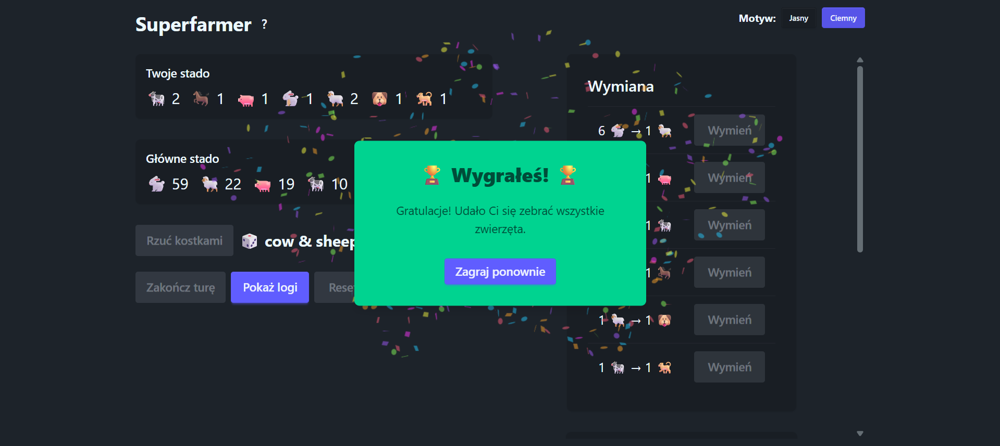
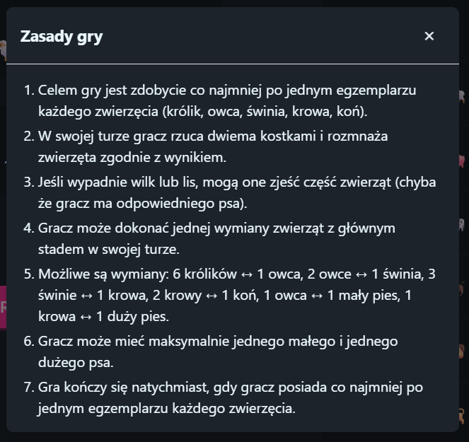
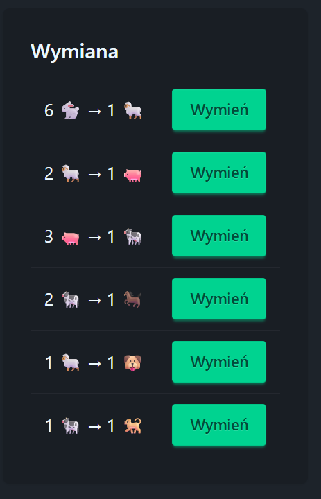

#  Superfarmer

## Zrzuty ekranu

<p align="center">
  
</p>
<p align="center"><b>Ekran startowy z wyborem opcji</b></p>

<p align="center">
  
</p>
<p align="center"><b>Powiadomienie o zwycięstwie i konfetti</b></p>

<p align="center">
  
</p>
<p align="center"><b>Podgląd zasad gry</b></p>

<p align="center">
  
</p>
<p align="center"><b>Tabela wymian i rozmieniania</b></p>

---

Webowa wersja gry planszowej Superfarmer (React + Flask + Redis)

---

## Wymagania
- Node.js (zalecane v18+)
- npm lub yarn
- Python 3.8+
- pip
- Redis (lokalnie lub zdalnie)
- **Windows:** do uruchamiania skryptów bashowych (`start-dev.sh`, `start-prod.sh`) wymagany jest [WSL](https://learn.microsoft.com/pl-pl/windows/wsl/) lub [Git Bash](https://gitforwindows.org/)

---

## Jak uruchomić projekt

### 1. Sklonuj repozytorium
```bash
git clone <adres_repo>
cd superfarmer
```

### 2. Backend (Flask + Redis)

#### a) Przejdź do katalogu backend
```bash
cd backend
```

#### b) (Opcjonalnie) Utwórz i aktywuj wirtualne środowisko Pythona
```bash
python3 -m venv venv
source venv/bin/activate  # Linux/macOS
# lub
venv\Scripts\activate   # Windows
```

#### c) Zainstaluj zależności
```bash
pip install -r requirements.txt
```

#### d) Upewnij się, że Redis jest **zainstalowany** i uruchomiony
```bash
redis-server
```
Jeśli nie masz Redisa, zainstaluj go np. przez `sudo apt install redis-server` lub pobierz z https://redis.io/download

#### e) Uruchom backend Flask
```bash
python app.py
```
Backend będzie dostępny pod adresem: [http://localhost:4000](http://localhost:4000)

### 3. Frontend (React)

#### a) Przejdź do katalogu frontend
```bash
cd ../frontend
```

#### b) Zainstaluj zależności
```bash
npm install
```

#### c) Uruchom frontend (tryb developerski)
```bash
npm start
```
Aplikacja będzie dostępna pod adresem: [http://localhost:3000](http://localhost:3000)

#### d) Budowanie produkcyjne
```bash
npm run build
```
Wynik znajdziesz w `frontend/build`

---

## Najważniejsze komendy

### Backend
- `pip install -r requirements.txt` – instalacja zależności Pythona
- `python app.py` – uruchomienie serwera Flask
- `redis-server` – uruchomienie serwera Redis (jeśli nie działa w tle)

### Frontend
- `npm install` – instalacja zależności Node.js
- `npm start` – uruchomienie aplikacji w trybie developerskim (hot reload)
- `npm run build` – budowanie aplikacji do produkcji (statyczny katalog `build`)

### Skrypty automatyczne
- `./start-dev.sh` – uruchamia backend i frontend w trybie developerskim (wymaga uprawnień do uruchamiania skryptów bash)
- `./start-prod.sh` – uruchamia backend i frontend w trybie produkcyjnym (wymaga wcześniejszego zbudowania frontendu)

---

## Szybki start (TL;DR)
```bash
# Najprościej: jeden skrypt (Linux/macOS/WSL/Git Bash)
./start-dev.sh

# Lub ręcznie:
cd backend
pip install -r requirements.txt
redis-server &
python app.py

# Nowe okno terminala
cd ../frontend
npm install
npm start
```

---

## Rozwiązywanie problemów (Troubleshooting)
- **Windows:** Skrypty bashowe (`.sh`) wymagają WSL lub Git Bash. Na czystym CMD/PowerShell nie zadziałają.
- **Redis:** Jeśli pojawia się błąd połączenia z Redisem, upewnij się, że Redis jest zainstalowany i uruchomiony (`redis-server`).
- **Port zajęty:** Jeśli pojawi się błąd, że port 3000 (frontend) lub 4000 (backend) jest zajęty, zamknij inne aplikacje korzystające z tych portów lub zmień port w konfiguracji.
- **Uprawnienia do skryptów:** Jeśli nie możesz uruchomić `./start-dev.sh`, nadaj uprawnienia: `chmod +x start-dev.sh`.
- **Brak Pythona lub Node w PATH:** Upewnij się, że polecenia `python`, `pip`, `node`, `npm` są dostępne w terminalu.
- **Brak połączenia frontend ↔ backend:** Sprawdź, czy oba serwery są uruchomione i czy nie blokuje ich firewall.

---

## Funkcjonalności

- [x] Rzucanie kostkami
- [x] Rozmnażanie zwierząt
- [x] Ataki lisa i wilka
- [x] Obrona przez psy
- [x] Wymiana zwierząt (UI + logika)
- [x] Warunek zwycięstwa
- [x] Reset gry
- [x] Log zdarzeń
- [ ] Obsługa wielu graczy (lokalnie)
- [ ] Gra z botem
- [ ] Przełączanie tur
- [ ] Lepszy UI (plansza, animacje, multiplayer)

## Plany/progres
- [ ] Dodanie obsługi wielu graczy (przełączanie tury, oddzielne stada)
- [ ] Dodanie bota (AI)
- [ ] Ulepszenie UI/UX

---

Projekt do rozwoju – patrz checklistę powyżej! 